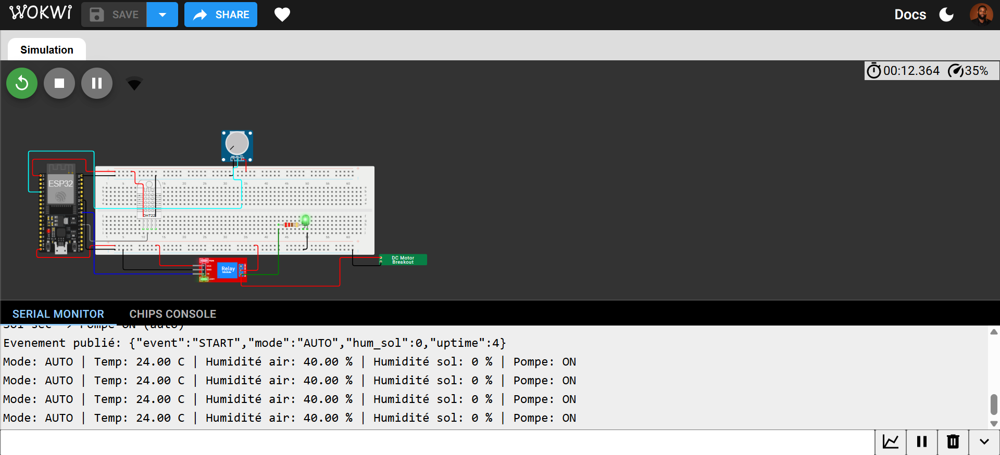
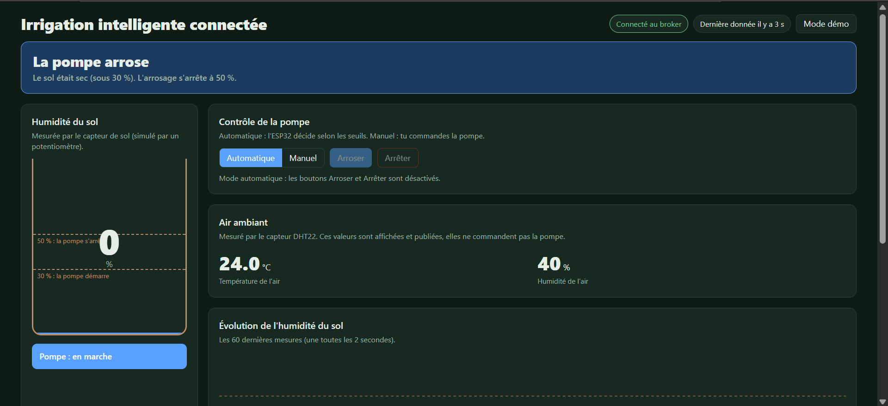

# Irrigation intelligente connectée (MQTT)

Projet avancé N°5 — **Formation EIC 3.0, Électronique & Prototypage**

Système d'irrigation intelligente basé sur un **ESP32**, capable de surveiller l'humidité du sol, la température et l'humidité de l'air, puis de commander automatiquement une pompe.

Les données sont transmises en temps réel via **MQTT** et affichées sur un **tableau de bord web**.

## Aperçu

Le projet combine :

- un **ESP32** pour la logique de contrôle ;
- un **DHT22** pour la température et l'humidité de l'air ;
- un **potentiomètre** pour simuler l'humidité du sol ;
- un **relais** et une **pompe** ;
- **MQTT / HiveMQ** pour la communication ;
- un **dashboard web** pour la supervision et le contrôle à distance.

## Fonctionnalités

- Mesure de l'humidité du sol
- Mesure de la température
- Mesure de l'humidité de l'air
- Arrosage automatique
- Mode manuel
- Commande de la pompe à distance
- Communication MQTT en temps réel
- Affichage de l'état de la pompe
- Graphique de l'humidité du sol
- Historique des cycles d'arrosage
- Arrêt de sécurité
- Mode démo du tableau de bord

## Démonstration

- **Simulation Wokwi** : https://wokwi.com/projects/476685965209533441
- **Dashboard Web** : `https://`

## Captures

### Simulation Wokwi



### Tableau de bord



## Technologies utilisées

- ESP32
- Arduino / C++
- Wokwi
- MQTT
- HiveMQ
- HTML5
- CSS3
- JavaScript
- MQTT.js
- GitHub Pages

## Structure du projet

```text
.
Irrigation-intelligente-connecte/
│
├── README.md
│
├── wokwi/
│   ├── sketch.ino
│   ├── libraries.txt
│   ├── diagram.json
│   ├── pompe-eau-12v.chip.json
│   └── pompe-eau-12v.chip.c
│
├── docs/
│   ├── index.html
│   ├── style.css
│   └── script.js
│
└── images/
    ├── simulation.png
    ├── serial-monitor.png
    └── dashboard.png
```

## Utilisation

### Simulation

Ouvrir la simulation Wokwi :

https://wokwi.com/projects/476685965209533441

Puis lancer le projet avec **Play**.

### Tableau de bord

Pour l'utiliser localement, conserver les fichiers suivants dans le même dossier :

```text
index.html
style.css
script.js
```

Puis ouvrir `index.html` dans un navigateur.

Le dashboard peut également être publié avec **GitHub Pages**.

## Équipe

**Groupe Lockly**

- Jean Robert Junior Benoit
- Jean Kelly Saingilus
- Fritzlord Demerzier
- Jean Lesly Jocelyn

---

Projet réalisé dans le cadre de la formation **EIC 3.0 — Électronique & Prototypage**.
